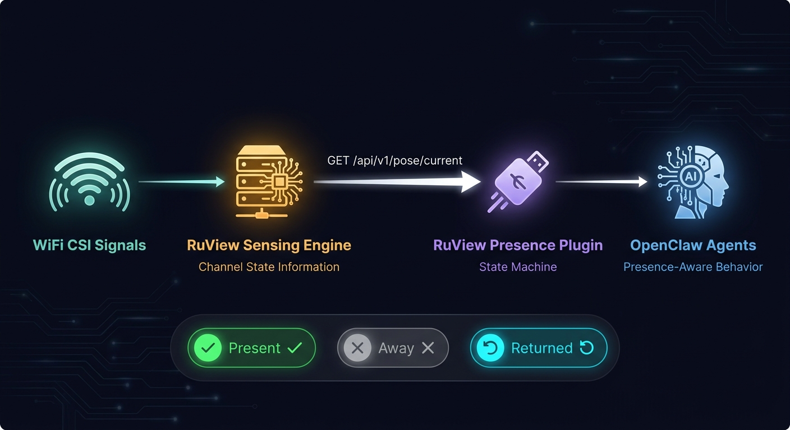
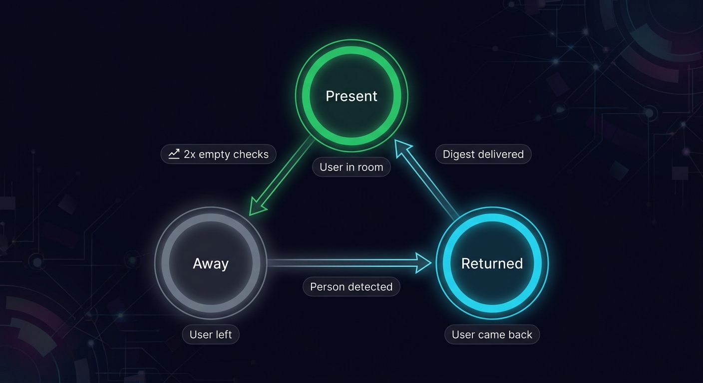

<p align="center">
  
</p>

<p align="center">
  <a href="https://github.com/DevvGwardo/openclaw-ruview-presence/actions/workflows/ci.yml"></a>
  
  <a href="https://github.com/openclaw/openclaw"></a>
  <a href="LICENSE"></a>
</p>

# RuView Presence

**Your AI agents know when you're at your desk.** No cameras, no wearables: just WiFi.

This [OpenClaw](https://github.com/openclaw/openclaw) plugin reads presence from a [RuView](https://github.com/ruvnet/RuView) WiFi sensing server. When you walk away, non-urgent messages are held. When you come back, your agent opens with a summary of what you missed:

```text
Welcome back! You were away for 42m.

While you were away:
- 1 message(s) queued (github: 1)
- 1 task(s) updated
- 1 urgent item(s) were sent immediately

Queued items:
- [message · github] PR #12 approved by reviewer
- [task] nightly build finished

Ready when you are.
```

> [!IMPORTANT]
> **Detecting that you've left needs real CSI hardware** (such as ESP32-S3 nodes, ~$54). Out of the box RuView runs in simulation mode, which always reports someone present. The included macOS RSSI bridge feeds real signal strength but synthetic motion, so it can't detect an empty room either. Both are fine for trying the plugin out. See [Hardware options](#hardware-options).

---

## How it works

<p align="center">
  
</p>

Before each agent turn, the plugin polls RuView (at most once per `pollIntervalMs`) and moves between three states:

| State | What happens |
|:------|:-------------|
| **Present** | Agents work normally |
| **Away** | After `debounceCount` empty readings in a row. Non-urgent events are held; urgent ones are still sent right away |
| **Returned** | On the first detection after being away. The digest is added to the agent's context, the queue is cleared, and the state goes back to present |

<p align="center">
  
</p>

---

## Quick start

### 1. Start RuView

```bash
# Simulation: no hardware, synthetic data (source: "simulated")
docker run -d -p 3000:3000 --name ruview \
  -e RUVIEW_ALLOW_UNAUTHENTICATED=1 \
  ruvnet/wifi-densepose:latest

# Live: also listen on UDP 5005 for CSI frames from ESP32 nodes or the macOS bridge
docker run -d -p 3000:3000 -p 5005:5005/udp --name ruview \
  -e RUVIEW_ALLOW_UNAUTHENTICATED=1 \
  -e RUVIEW_UDP_BIND=0.0.0.0 -e RUVIEW_UDP_INSECURE_LAN=true \
  ruvnet/wifi-densepose:latest
```

`RUVIEW_ALLOW_UNAUTHENTICATED=1` is for a local or trusted network only. Otherwise set `RUVIEW_API_TOKEN` on the server and `apiKey` in the plugin config.

Check that it's up:

```bash
curl -s http://localhost:3000/health/live               # {"status":"alive",...}
curl -s http://localhost:3000/api/v1/pose/current | jq .source   # "simulated", or "esp32"/"csi" when live
```

### 2. Install the plugin

```bash
git clone https://github.com/DevvGwardo/openclaw-ruview-presence.git
openclaw plugins install ./openclaw-ruview-presence      # or: install -l to link for development
```

### 3. Configure it

In `openclaw.json` (every option is listed in the [configuration reference](#configuration-reference)):

```json
{
  "plugins": {
    "entries": {
      "ruview-presence": {
        "enabled": true,
        "config": {
          "ruviewUrl": "http://localhost:3000"
        }
      }
    }
  }
}
```

Or from the CLI:

```bash
openclaw config set plugins.entries.ruview-presence.config '{"ruviewUrl":"http://localhost:3000"}' --strict-json
```

### 4. Restart the gateway and check it

```bash
openclaw plugins list | grep ruview        # should show ruview-presence as enabled
openclaw gateway call ruview.health        # live probe of RuView through the plugin
openclaw gateway call ruview.presence      # current state
```

The gateway log should show `ruview-presence: initialized (url=..., threshold=0.3, debounce=2, auth=off)`.

### The bundled skill

The plugin ships a `ruview-presence` skill that loads automatically when the plugin is enabled. It tells the agent that presence is already handled, so the agent doesn't poll on its own, and shows it how to turn the welcome-back digest into a reply. It also teaches the agent how to query RuView on demand, for questions like "is anyone in the office?" or "what's my breathing rate?". To check that it loaded:

```bash
openclaw skills info ruview-presence
```

---

## Sending events to the queue

Anything that would notify you (a channel, a cron job, another plugin) can go through `ruview.queueEvent` first:

```bash
openclaw gateway call ruview.queueEvent \
  --params '{"type":"message","summary":"PR #12 approved","channel":"github"}'
# {"queued": true, "total": 1}   → you're away: hold it, it'll be in the digest
# {"queued": false, "total": 0}  → you're here (or it's urgent): deliver it now
```

- `type`: `message`, `task`, `notification` or `error`
- `summary`: required; the text shown in the digest (max 500 chars)
- `channel`: optional; grouped in the digest counts
- `priority`: `normal` (default) or `urgent`. Urgent events always return `queued: false`, and are counted in the digest as sent

Invalid params return an `INVALID_REQUEST` error.

---

## Configuration reference

| Option | Type | Default | Description |
|:-------|:-----|:--------|:------------|
| `ruviewUrl` | `string` | `http://localhost:3000` | RuView base URL (a trailing slash is trimmed). Env: `RUVIEW_API_URL` |
| `apiKey` | `string` | _(none)_ | Sent as `Authorization: Bearer ...` if RuView auth is on. Env: `RUVIEW_API_KEY` |
| `pollIntervalMs` | `number` | `10000` | Minimum time between polls (min `1000`) |
| `confidenceThreshold` | `number` | `0.3` | Minimum detection confidence (0–1) to count as present |
| `debounceCount` | `number` | `2` | Empty readings in a row before switching to away |
| `enableDigest` | `boolean` | `true` | Add the welcome-back digest on return |
| `enableZoneAwareness` | `boolean` | `false` | Also fetch RuView's zone summary; exposed as `zones` in `ruview.presence` |
| `maxQueueSize` | `number` | `100` | Max held events (1–500); the oldest non-urgent is dropped first |

Only `ruviewUrl` and `apiKey` can come from environment variables; config values take precedence. Invalid values are logged and corrected: `pollIntervalMs` is raised to 1000, and anything else falls back to its default.

---

## Gateway RPC methods

| Method | Scope | Returns |
|:-------|:------|:--------|
| `ruview.presence` | `operator.read` | `{ state, zone, awaySince, queuedEvents, detectedPersons, source, zones }` |
| `ruview.diagnostics` | `operator.read` | Everything above except `zones`, plus `previousState, emptyCheckCount, consecutiveErrors, lastErrorAt, lastDataAgeMs, isLive` |
| `ruview.health` | `operator.read` | `{ ok: true, source, detected, persons, zone, dataAgeMs }` from a live probe (ignores the poll interval), or an `UNAVAILABLE` error |
| `ruview.queueEvent` | `operator.write` | `{ queued, total }`; see [Sending events to the queue](#sending-events-to-the-queue) |

---

## Hardware options

| Option | Hardware | Cost | Can detect absence? |
|:-------|:---------|:-----|:--------------------|
| **Simulation** | Any computer | $0 | ❌ Always reports someone present |
| **macOS RSSI bridge** | Any Mac + `scripts/live-rssi-bridge.py` | $0 | ❌ Real signal strength, synthetic motion. Good for testing the live pipeline |
| **ESP32 (recommended)** | 3–6× ESP32-S3 + router | ~$54 | ✅ Full CSI: pose, breathing, heart rate, motion |
| **Research NICs** | Intel 5300 / Atheros AR9580 | ~$50–100 | ✅ Full CSI with 3×3 MIMO |

**The macOS bridge.** Apple Silicon WiFi chips don't expose per-subcarrier CSI, only signal strength. The bridge reads RSSI from `system_profiler`, wraps it in CSI frames, and sends them to RuView on UDP 5005. RuView then switches from `simulated` to `esp32` and reports your real `mean_rssi`:

```bash
python3 scripts/live-rssi-bridge.py          # 20 Hz to 127.0.0.1:5005
curl -s http://localhost:3000/api/v1/sensing/latest | jq '.source, .features.mean_rssi'
```

`system_profiler` takes several seconds per read, so the first real RSSI value appears after about 5–10s. Until then frames carry a -50 dBm placeholder.

---

## Reliability

- **RuView down?** The plugin keeps the last known state and retries on the next poll. Failures are counted in `consecutiveErrors`, and a warning is logged on the 1st and every 10th.
- **Brief signal drop?** You're only marked away after `debounceCount` empty readings in a row.
- **Stale data?** Readings older than 30s are still used, but a warning is logged once and the age is shown as `lastDataAgeMs`.
- **Long absence?** The queue is capped at `maxQueueSize`, and it's cleared on every return (even with the digest off), so one absence never spills into the next.
- **Simulated data?** Logged once when the source changes, and `isLive` in `ruview.diagnostics` is `false`.

---

## Troubleshooting

| Problem | Fix |
|:--------|:----|
| `unknown method: ruview.presence` | The plugin isn't loaded. Check `openclaw plugins list`, then restart the gateway. Plugin versions before 0.1.2 don't load on current OpenClaw (missing `activation.onStartup`) |
| Always "present" | Expected with simulation or the macOS bridge; see [Hardware options](#hardware-options) |
| `source` stays `simulated` | No frames on UDP 5005. Make sure `-p 5005:5005/udp` is published and check `docker logs ruview` |
| `refusing to start ... RUVIEW_API_TOKEN is unset` | Add `-e RUVIEW_ALLOW_UNAUTHENTICATED=1` (trusted networks only), or set `RUVIEW_API_TOKEN` on the server and `apiKey` in the config |
| RuView won't bind UDP on `0.0.0.0` | `RUVIEW_UDP_BIND=0.0.0.0` also needs `RUVIEW_UDP_INSECURE_LAN=true`. For local-only use, keep the default `127.0.0.1` |
| Port 3000 already in use | Map another port (`-p 3100:3000`) and set `ruviewUrl` to match |
| RuView returns `429` | Raise `pollIntervalMs` to `15000` or more. A `429` counts as unreachable, so the state is kept meanwhile |
| `ruview.health` returns `UNAVAILABLE` | RuView isn't reachable at `ruviewUrl`. Try `curl <ruviewUrl>/health/live` from the gateway host |

---

## RuView API reference

<details>
<summary>The RuView responses this plugin reads (click to expand)</summary>

### Pose Detection (`GET /api/v1/pose/current`)

The primary endpoint used for presence detection.

```json
{
  "timestamp": 1773088911.824,
  "source": "simulated",
  "total_persons": 1,
  "persons": [
    {
      "id": 1,
      "confidence": 0.78,
      "zone": "zone_1",
      "bbox": { "x": 270.4, "y": 133.2, "width": 136.6, "height": 235.1 },
      "keypoints": [
        { "name": "nose", "confidence": 0.59, "x": 336.5, "y": 151.8, "z": -0.22 },
        { "name": "left_eye", "confidence": 0.61, "x": 326.1, "y": 146.0, "z": -0.22 },
        { "name": "right_eye", "confidence": 0.66, "x": 346.1, "y": 143.2, "z": -0.22 },
        { "name": "left_shoulder", "confidence": 0.77, "x": 311.3, "y": 185.6, "z": -0.22 },
        { "name": "right_shoulder", "confidence": 0.74, "x": 360.6, "y": 186.9, "z": -0.22 }
      ]
    }
  ]
}
```

Each person includes 17 DensePose-compatible keypoints: nose, left/right eye, left/right ear, left/right shoulder, left/right elbow, left/right wrist, left/right hip, left/right knee, left/right ankle.

### Zone Summary (`GET /api/v1/pose/zones/summary`)

```json
{
  "zones": {
    "zone_1": { "person_count": 1, "status": "monitored" },
    "zone_2": { "person_count": 0, "status": "clear" },
    "zone_3": { "person_count": 0, "status": "clear" },
    "zone_4": { "person_count": 0, "status": "clear" }
  }
}
```

### Vital Signs (`GET /api/v1/vital-signs`)

```json
{
  "vital_signs": {
    "breathing_rate_bpm": 9.4,
    "breathing_confidence": 0.83,
    "heart_rate_bpm": 44.4,
    "heartbeat_confidence": 0.67,
    "signal_quality": 0.52
  },
  "source": "simulated",
  "tick": 19612
}
```

### Full Sensing Data (`GET /api/v1/sensing/latest`)

Returns everything above plus raw signal features (mean RSSI, spectral power, motion/breathing band power), per-sensor subcarrier amplitudes, RF tomography voxel grid, and classification.

```json
{
  "classification": {
    "presence": true,
    "motion_level": "present_still",
    "confidence": 0.78
  },
  "features": {
    "mean_rssi": -37.0,
    "variance": 15.1,
    "spectral_power": 249.0,
    "dominant_freq_hz": 1.85,
    "breathing_band_power": 16.4,
    "motion_band_power": 13.7,
    "change_points": 8
  }
}
```

### Health Check (`GET /health/live`)

```json
{ "status": "alive", "uptime": 1961 }
```

</details>

---

## Development

```bash
npm install
npm run typecheck   # tsc --noEmit (strict)
npm test            # vitest
```

CI runs both, plus a syntax check of the bridge script, on every push and PR.

```text
index.ts                  Plugin: polling, state machine, digest, RPC methods
openclaw.plugin.json      Manifest: config schema, UI hints, startup activation
tests/presence.test.ts    Unit tests (state machine, queue, RPC handlers)
scripts/live-rssi-bridge.py  macOS RSSI → CSI bridge for RuView
skills/ruview-presence/   Bundled agent skill (loaded with the plugin)
docs/                     README images
.github/workflows/ci.yml  CI
```

## Requirements

- [OpenClaw](https://github.com/openclaw/openclaw) `>=2026.3.1` (tested on 2026.6.34), on the Node version your OpenClaw release requires
- [RuView](https://github.com/ruvnet/RuView) sensing server (Docker or native)
- Python 3.10+ for the optional macOS bridge

## License

[MIT](LICENSE)
